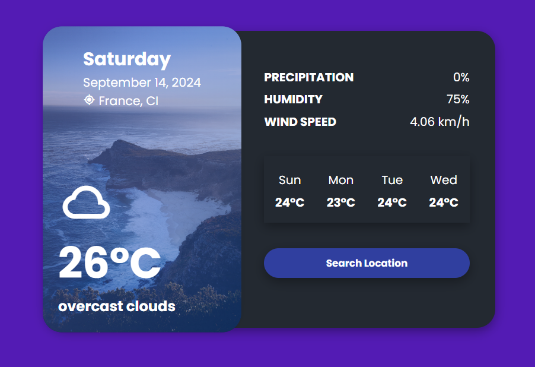

# Weather Web App

This is a simple weather web application that displays real-time weather information for any city. The app uses the [OpenWeather API](https://openweathermap.org/api) to fetch weather data and displays it using a clean and responsive user interface built with HTML, CSS, and JavaScript.

## Features

- Fetches real-time weather data for any city
- Displays temperature, weather condition, humidity, and wind speed
- Responsive design that works on both desktop and mobile devices
- Easy to use and lightweight

## Tech Stack

- HTML
- CSS
- JavaScript
- [OpenWeatherAPI](https://openweathermap.org/api)

## Prerequisites

Before running this project, you will need an API key from OpenWeatherAPI. Follow these steps to get your API key:

1. Go to [OpenWeatherAPI](https://home.openweathermap.org/users/sign_up) and sign up for a free account.
2. Once you are logged in, navigate to the "API keys" section of your dashboard and copy your unique API key.
3. Replace the apiKey constant in index.js with your API key.

## Usage
1. Enter the name of the city you want to check the weather for.
2. Click on the "Get Weather" button.
3. The app will fetch and display the current weather information for that city.
   
## Screenshot

